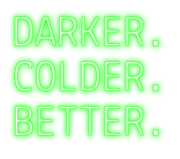
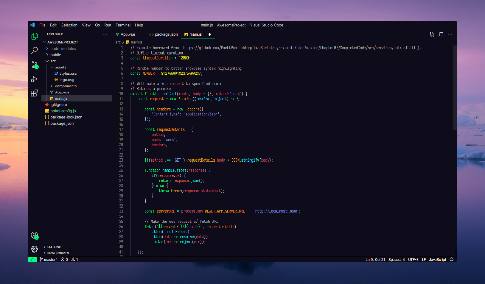

    

Embrace the depths of darkness with IceBerg Dark II, a captivating theme that embodies the elegance and mystery of the deep ocean. Immerse yourself in a world of rich, dark hues and subtle accents, designed to enhance your coding experience with sophistication and style.

Inspired by the enigmatic beauty of icebergs, IceBerg Dark II seamlessly blends shades of deep blue, charcoal gray, and midnight black to create a visually stunning and soothing environment for your coding endeavors. The theme's carefully crafted color palette ensures that your code remains easy to read and comprehend, while also providing a sense of tranquility and focus.

